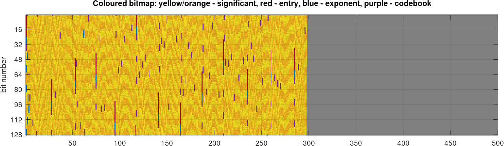

# A free zero-delay audio codec (zdac)
Compress and encode audio data with no reference to future samples, using:
1) (linear) predictive coding,
2) adaptive quantization of the residue steered by a masking model,
3) and entropy coding (Huffman)

Author: [Marc René Schädler](mailto:suaefar@googlemail.com)

## Goal
Design an audio codec without perceptual artifacts which does not require buffering future samples.
The user decides which block size is suitable for an application.
The scope is somewhere between opus and raw PCM, so are the expected bit rates.

## Status
Currently in conception phase:
- Working implementation in GNU/Octave (done)
- Tuning default parameters (still progress)
- Adding documentation (good progress)
- Implementation in C (not started, planned this winter)

## Short description
Each channel is processed independently, no joint coding is performed.
The input is assumed to be sampled at 32 kHz with arbitrary precision.
The 32 kHz are not set it stone, but the sample rate is particularly costly factor in this approach.
Unless I see strong evidence that frequencies beyond 16 kHz, that is, beyond the last auditory channel, are needed, I think it will be fine.

The stream starts with an enty-point.
This means, the sample value is encoded with 20 bit precision and prefixed with three bits (000) to signal the entry point, and all variables are reset to default values.
Entry points are inserted every ENTRY milliseconds.
In the [coloured bitmap](images/bitmap.png), entry-points are indicated with red color.
The further encoding is then independent from the data before the last entry-point.

The value of the next sample is predicted with a deterministic predictor that runs in sync in the encoder and decoder.
For the first sample after the entry-point, the predictor only knows one last sample value, for later samples the predictions can get better.
Only the residual, the error of the prediction is transmitted.
If the prediction is close to the actual value, the (absolute value of the) residual is small and it might be possible to encode it with less bits.

To encode (absolute-value-wise) small residuals with less bits, a set of codebooks is used which assume different root-mean-square (RMS) values of the residual, namely 2^-(0:13).
The codebooks are generated by Huffman coding assuming a normal distribution with the corresponding RMS-values and known to the encoder and decoder.
The energy of the residual signal is tracked in the encoder and the used codebook is updated when needed.
The codebook (possible values 0:13) is encoded with 4 bit, and a change is signalled with three bits (010).
In the [coloured bitmap](images/bitmap.png), codebook updates are indicated with purple color.
The logic includes a hysteresis to avoid osscillation.
Frequent updates can save bits on the residual values, but add additional bits for signalling the changes.

All transmitted values are represented as a significant/exponent pair, where `value = significant * 2^(exponent)`.
Only the significant (of the residue) is encoded as described in the last paragraph.
The exponent (possible values 0:1:31) is encoded with 5 bit and only updated when required, which is signalled with three bits (001).
In the [coloured bitmap](images/bitmap.png), exponent updates are indicated with blue color.
As the exponent determines the quantization noise, it is mainly steered by the masking model.
The masking model determines the acceptable amplitude of quantization noise and proposes an optimal values.
However, the suggested value is limited to a predefined range to guarantee that the significant is encoded with at least 2 (min) and 12 (max) bit precision and limit the quantization noise.
The logic includes a hysteresis to avoid osscillation.
Frequent updates can save bits on the residual values, but add additional bits for signalling the changes.

Hence, good predictions (which happen for harmonic signals) as well as large exponent values (which happen for non-harmonic signals) result in low significant values, which are compressed with the adaptive Huffman-coding.
The Huffman-coded residual significant values are signalled with 1 bit (1) to distinguish them from the (0XX) control codes for entry-point, codebook and exponent updates.
That approach results in a minimum bit rate of two bits per sample (64 kbit/s at 32 kHz sample rate) which is approached in silence.
In the [coloured bitmap](images/bitmap.png), significant values are indicated with yellow/orange color.

The [best-performing predictor](predictor_lpc.m) is currently based on linear predicive coding (LPC) with 4 coefficients inferred from the (max) last 32 samples.
Other values work as well.
Higher values increase complexity and only help on predictable signals.
You can observe the performance of the predictor by running the [demo script](play_demo.m) with different predictors (e.g., set `predictor = 0`).
Here, a deep neural network based predictor might perform even better?

The masking model, which runs only in the encoder, is based on a 39-band fourth-order Gammetone filterbank implemented as IIR filters.
The spectral energy in each band is tracked and the minimum distance (in log2-domain) of the spectral energy to the pre-calculatred spectral energy of a full-scale model quantization noise determines the proposed exponent.
When the encoder follows the suggestion of the masking model, the quantization noise is at or below the modelled masking threshold.
The quality-factor of the Gammatone-filters can be modified with the QUALITY variable (effect described below).
Higher masking thresholds result in higher exponents, that is higher quantization noise levels, and consequently in lower significant values and bit rates.

## Usage
First, run `./setup.sh` to generate some needed files (needs octave, octave-signal and liboctave-dev).
This generates the codebooks and compiles a mex file used to set up the Gammatone filter bank.

Then, run `play_demo.m` (in Octave) to see if encoding and decoding works.
This script encodes and decodes a signal and shows the state of some internal variables of the encoder.

Run `./run_benchmark.sh <folder-with-wav-files-sampled-at-32kHz> <PREDICTOR> <QUALITY> <ENTRY>` to encode and decode the audio files in the folder and get some encoding statistics where the currently considered default values are as follows: PREDICTOR = 3, QUALITY = 0, ENTRY = 8.

To compare zdac to opus at compareable bit rates you can run `./run_opus_comparison.sh <WAVFILE> <OPUS_BITRATE> <ZDA_PREDICTOR> <ZDA_QUALITY> <ZDA_ENTRY>`.
The script encodes and decodes the WAVFILE and produces a figure comparing the respective differences to the input signal in the time domain and in the log Mel-spectrogram domain.
After the first run with OPUS_BITRATE=512, add the bitrates of the (possibly two) channels encoded with zdac and set OPUS_BITRATE to this value.
The figures are saved in png-files for each channel separately.
The comparison is not ideal, because zdac is developed with a target samplerate of 32 kHz and opus is not compatible with this setting, which requires resampling prior to the comparison.

### PREDICTOR
The predictor predicts the next sample values based on past sample values.
It is deterministic and runs in the encoder and in the decoder.
The variance in the signal that can be predicted from the past samples doesn't have to be transmitted.
If the predictor works well, the residual signal has only low amplitude and can be encoded with fewer bits.
The improvements to the bit rate by the predictor are lossless.

Available predictors are:

0) [Zero](predictor_zero.m) predicts always zero
1) [Simple](predictor_simple.m) predicts the last value
2) [Linear extrapolation](predictor_linear.m) Extrapolates linearly using the last 2 samples
3) [Linear predictive coding](predictor_lpc.m) Uses LPC with (max) three coefficients on the (max) last 32 samples to predict the next sample

Possible future predictors could be:

4) Deep neural network predictor Not implemented but possibly better than LPC?

### QUALITY
The encoder estimates the current masking with a 39-band Gammatone filterbank.
The Q-factor (i.e., width) of these filters is steered with the quality variable.
The improvements to the bit rate by the masking model come with a loss of information.
In the ideal case, the loss is not perceivable.

Negative values mean broader filters, and hence increase the spectral masking of off-frequency signal parts.
A value of 0 is the default width, while -2 doubles the filter width, and -4 results in a quarter of the default filter width.
Values greater than one make the the filters narrower and result in decreased spectral masking, that is, less loss of information.
However, values greater than 1 probably don't make much sense.

### ENTRY
The encoder inserts from time to time the information that is required to start decoding the bit-stream.
The default is every 8 ms, which corresponds to every 256 samples at 32 kHz sampling rate.
This includes encoding the current sample value with 20 bit precision and resets the predictor, because values prior to the entry point might be unknown to the decoder.
Adding entry points more often will increase the required bits to encode the stream.
This variable does not add a delay to the encoded bit-stream, but low values, e.g. 1 ms, ensure that the decoder can recover quickly if data was lost during the transmission.

## Performance (in terms of achievable bit rates)
A small parameter space exploration for different values for QUALITY and ENTRY.
Read the corresponding [README.md](set_opus_comparison/README.md) on how to achieve the required audio samples.
Once prepared, the following commands encode and decode the channels of these files with different parameters and generate basic statistics on their bit rates.

    for QUALITY in 0 -2; do
      for ENTRY in 1 2 4 8 16 32; do
        ./run_benchmark.sh set_opus_comparison/32k_32bit_2c/ 3 $QUALITY $ENTRY
      done
    done | tee results.txt

    for QUALITY in 0 -2; do
      for ENTRY in 1 2 4 8 16 32; do
        RATES="[$(cat results.txt  | grep "\-Q${QUALITY}-E${ENTRY}/" | cut -d' ' -f7 | tr -s "\n" | tr "\n" ",")]"; octave -q --eval "rates=${RATES};printf('QUALITY=%.1f ENTRY=%.1f %.0f %.0f %.0f kbit/s\n',${QUALITY},${ENTRY},mean(rates)./1000,min(rates)./1000,max(rates)./1000)"
      done
    done

Encoding each sample with 16 bit, the required bit rate would be `(16*32000 =) 512 kbit/s`.
The theoretical limit with the chosen approach is 1 bit per sample, and would result in `(1*32000 =) 32 kbit/s`.
However, that would require to constrain the Huffman tree generation, which is not implemented.
Hence, an additional prefix bit currently indicates if a significant value or a controlcode was transmitted, resulting in a minimum of 2 bit per sample, i.e. `(2*32000 =) 64 kbit/s`.

The following average/minimum/maximum bit rates in kbit/s (per channel) across files were achieved:

| QUALITY | ENTRY | AVG | MIN | MAX |
|--------:|------:|----:|----:|----:|
|       0 |     1 | 235 | 172 | 306 |
|       0 |     2 | 208 | 149 | 274 |
|       0 |     4 | 191 | 136 | 253 |
|       0 |     8 | 182 | 130 | 239 |
|       0 |    16 | 178 | 126 | 233 |
|       0 |    32 | 176 | 125 | 230 |

| QUALITY | ENTRY | AVG | MIN | MAX |
|--------:|------:|----:|----:|----:|
|      -2 |     1 | 217 | 165 | 268 |
|      -2 |     2 | 189 | 142 | 235 |
|      -2 |     4 | 172 | 129 | 217 |
|      -2 |     8 | 163 | 122 | 207 |
|      -2 |    16 | 159 | 119 | 202 |
|      -2 |    32 | 156 | 116 | 201 |

More detailed statistics can be found the [reference results](results_reference.txt)
An example of how to read the data:

    RESULT: set_opus_comparison/32k_32bit_2c_ZDA-P3-Q0-E1/./04-liberate.wav 1 3 0.0 1.0 236876.2 7.402 160229 1186076/956106/115184/52336/62447 -29.7 -20.8

Of the file 04-liberate.wav the channel 1 was compressed with predictor 3, quality 0.0, and entry 1.0 with an average of 236876.2 bit/s, i.e. 7.402 bit per sample.
The encoder compressed 160229 samples to 1186076 bits, of which 956106 were used to encode significant values, 115184 to encode exponent values, 52336 to encode entry points, and 62447 to encode codebook updates.
The signal-to-(quantization)noise ratio is -29.7 dB, the largest deviation in a single sample value was -20.8 dB full-scale.

If you run the benchmark script, you can find the decoded samples in the corresponding `set_opus_comparison/32k_32bit_2c_ZDA-*` folders and judge the quality for yourself.

## Quick preliminary conclusion
The approach could approximately half the required bandwidth for ultra-low-latency audio applications.
However, short term (<1 ms) variability in the bit rate is probably considerable (up to approx 350 kbit/s).

## Discussion on possible applications
Some discussion on the #xiph channel on freenode.org brought up objections against developing a codec which falls between raw PCM (zero-delay) and opus (min 2.5 ms delay).
The main objections were:

1) Large network overhead renders the effort useless: IP4/UDP at least needs 224 bit per packet, IP6 is worse
2) The latency due to other network components is much larger: That is, we are optimizing on the wrong front

That triggered some thoughts about possible applications, where these two arguments do not apply.

The main advantage of zdac, in a prospective real-time implementation, should be that there is no limitation on block sizes, just like with PCM.
While using less bits to encode the sampled values, the quality should be perceptually on-par with 16 bit PCM.

That makes it's use attactive in cases where bandwidth matters, but close-to-no-latency combined with close-to-no-compromise-in-quality are the top priorities.
This puts some applications to the top of the list (only considerung latency, bandwidth, and quality; in exactly that order):

1) Natural acoustic interaction over distance: Achieve be-in-the-same-room perception (desireable for any acoustic interaction between humans)
2) Where airtime is more costly than cpu-cylces but zero-delay is a hard constraint (streaming between hearing devices?)
3) Where the saved bits can be used for other synced real-time ultra-low-delay data (positional data?)
4) Where the number of audiochannels would make using raw PCM infeasible in a context of zero-delay applications (e.g. with higher-order ambisoncis? wavefield synthesis?)

It remains to be investigated in which applications a reasonable benefit can be found.

My bet is on fiber-connected devices with low-latency (non-USB) sound equipment for the natural acoustic interaction of several humans on both sides.
Several audio streams would enable custom client-side downmixing with rich spatial information (e.g., with https://github.com/gisogrimm/ovbox).
Or, with several microphones and several loudspeakers, even remote spatial perception could be enabled.
Fiber-links can have, at least in the same city, latencies below 1 ms.
Non-USB sound cards can achive latencies below 3 ms.
Counting another 1 ms jitter buffer and 0.5 ms packet size it seems possibly to stay in the range of 10 ms acoustic round trip time.

The delay added by any codec would add twice to that number (minus 0.5 ms).

Also, the saved bandwidth could be used for redundancy, i.e. sending each packet twice, to avoid drop-outs, which is another important factor for sound quality.

